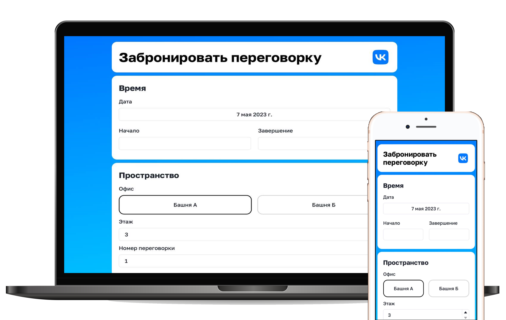

# Сервис бронирования переговорной

Тестовое задание для стажировки VK. Простая форма с выбором места и времени брони.

Работу приложения можно посмотреть [здесь](https://k0ndrateff.github.io/meeting-room-booking-vk).

Приложение адаптивно и хорошо смотрится как на десктопе, так и на мобильных устройствах.

## Про ход работы

Приложение написано на Реакте без стейт-менеджеров. В качестве библиотеки компонентов выбрал ChakraUI, но некоторые 
компоненты написал сам (в частности выбор башни). 

Для вёрстки использовал по большей части флексбоксы. Самым удобным решением для выбора даты и времени по моему стал 
нативный селектор. При нажатии на кнопку "Забронировать" всплывает тост, который показывает, что бронь прошла 
успешно (или указывает на ошибку в заполнении).

